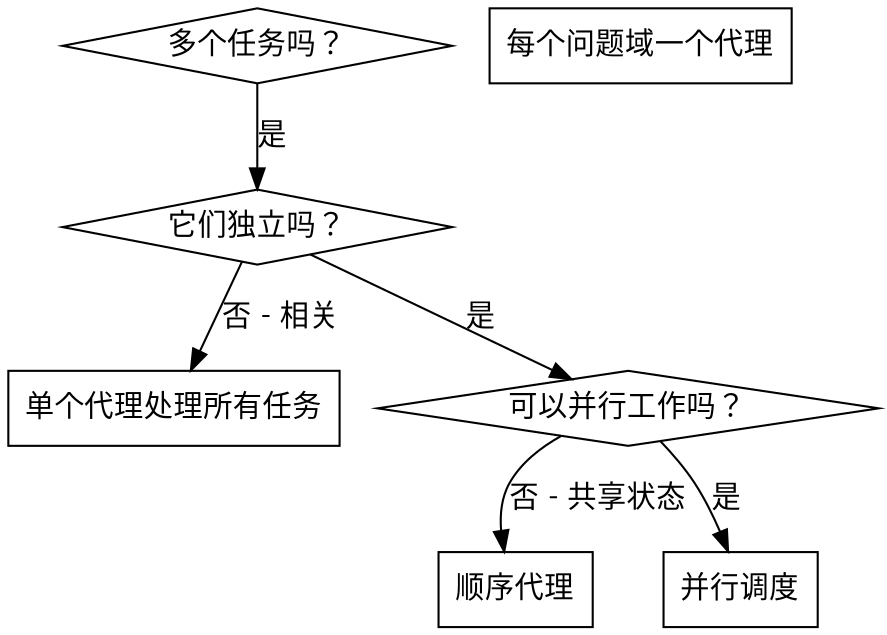
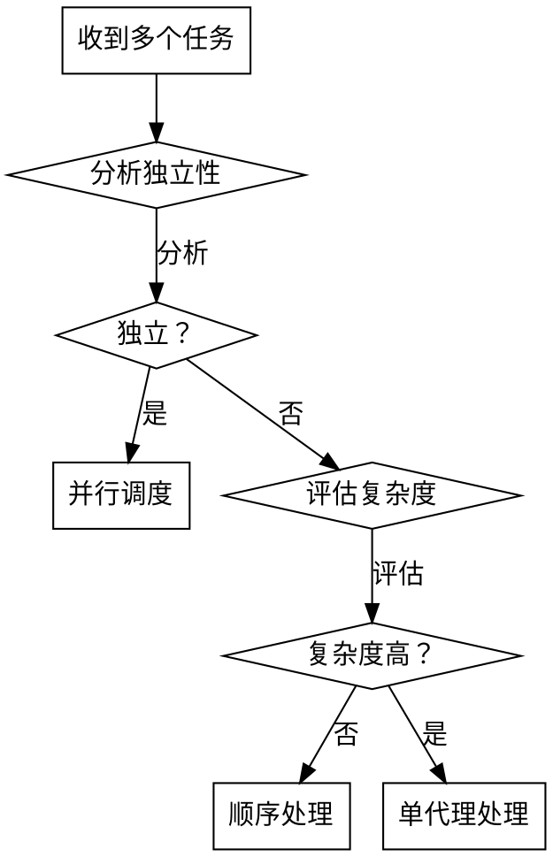

# 并行调度子代理

## 概述

当你有多个独立的任务或问题时，使用子代理并行执行可以显著提高效率。主代理负责调度和分配任务，子代理负责执行具体工作。

该技能集成了专业代理提示词系统，提供以下内置代理类型：
- 代码修复代理 (Code Fix Agent)
- 代码编写代理 (Code Generation Agent) 
- 测试生成代理 (Test Generation Agent)
- 代码审查代理 (Code Review Agent)
- 文档编写代理 (Documentation Agent)

完整的代理提示词模板和使用指南请参见：`dispatching-parallel-agents-zh/references/agent_prompts.md`

**核心原则：** 一个子代理处理一个独立问题域。让它们并行工作。

## 使用场景



**使用条件：**
- 3+ 个独立测试文件或模块
- 多个子系统独立工作
- 每个问题可以独立理解
- 任务之间无共享状态

**避免使用条件：**
- 任务相关（修复一个问题可能影响其他任务）
- 需要理解完整系统状态
- 代理间会互相干扰

## 模式结构

### 1. 识别独立域

按功能将任务分组：
- 文件A：审批流程
- 文件B：批处理完成行为
- 文件C：中止功能

每个域独立 - 修复审批流不影响中止功能。

### 2. 创建聚焦的代理任务

每个代理接收：
- **特定范围：** 一个文件或子系统
- **明确目标：** 完成这个任务
- **权限限制：** 不得更改无权限代码
- **预期输出：** 详细任务总结报告

### 3. 并行调度

```typescript
// 在AI环境中
Task("修复文件A - 权限：只读/src/approval", 提交路径="src/approval", 任务类型="修复bug")
Task("修复文件B - 权限：读写/src/batch", 提交路径="src/batch", 任务类型="添加功能") 
Task("修复文件C - 权限：只读/src/abort", 提交路径="src/abort", 任务类型="优化性能")
// 所有子代理并行执行
```

### 4. 汇总和整合

当子代理返回时：
- 阅读每个总结报告
- 验证修改没有冲突
- 执行集成测试
- 整合所有结果

## 子代理任务结构

良好的代理任务具有以下特点：
1. **聚焦：** 一个明确的范围
2. **自包含：** 所需上下文完整
3. **输出具体：** 子代理应返回什么

### 使用内置代理示例

完整的内置代理使用示例和模板请参见：`dispatching-parallel-agents-zh/references/agent_prompts.md`

**重要：调用 Task 时必须包含以下详细信息：**

1. **prompt**：完整的代理提示词模板（包含角色、工作流程、权限说明）
2. **config.permissions**：详细的权限配置
   - read：可读取的目录
   - write：可修改的目录  
   - execute：可执行的命令
   - forbidden：禁止访问的目录
3. **config.timeout**：超时时间（秒）
4. **config.output_format**：输出格式

**示例使用方式：**
```markdown
Task(
  description="修复登录会话问题",
  prompt="你是代码修复专家，专门负责分析和修复代码中的问题。\n\n工作流程：\n1. 分析问题...\n2. 定位根因...\n\n权限范围：只读 src/auth/*, src/models/*; 可修改 src/auth/*; 禁止修改 src/payment/*\n工作目录：C:/Users/Administrator/project/src/auth\n\n请修复会话超时问题...\n\n返回：详细任务总结报告。",
  config={
    "permissions": {
      "read": ["/src/auth/**/*", "/src/models/**/*", "/src/config/**/*"],
      "write": ["/src/auth/**/*"],
      "execute": ["npm test", "npm run build"],
      "forbidden": ["/src/payment/**/*", "/src/config/database.js"]
    },
    "timeout": 1800,
    "output_format": "detailed_report"
  }
)
```

## 权限管理

**子代理权限：**
- **读权限：** 可以查看代码、文档
- **写权限：** 可以修改指定目录下的文件
- **执行权限：** 可以运行测试、构建命令
- **受限权限：** 无权修改其他目录的代码

**冲突处理：**
- 如果子代理检测到需要修改其他目录的代码，报告主代理
- 主代理分析后决定是否调度其他代理或重新分配权限
- 重大修改需主代理审核

## 子代理任务总结报告格式

每个子代理必须生成以下格式的报告：

```
任务ID: [任务编号]
子代理: [代理类型 - 如代码修复代理、代码编写代理等]
执行时间: [开始-结束时间]
工作目录: [工作目录]
权限范围: [有权限修改的目录]

发现:
- 问题1: [详细描述，包括具体错误信息、堆栈跟踪等]
- 问题2: [详细描述]

解决方案:
- 方法1: [如何解决，包括具体的代码修改方案]
- 方法2: [如何解决]

修改的文件:
- src/file1.ts: [修改原因 - 为什么需要改]
- src/file2.ts: [修改原因]

测试结果:
- 修复前: [失败情况 - 具体错误]
- 修复后: [成功情况 - 测试通过]

遇到的问题:
- 权限不足: [需要主代理协助的具体内容]
  * 需要修改的文件路径: [如 src/backend/api/users.js]
  * 需要修改的代码内容: [具体的代码片段或实现方案]
  * 修改原因: [为什么必须这样修改]
  
- 需要其他模块: [需要联系其他子代理的具体任务]
  * 目标代理类型: [如后端开发代理]
  * 具体任务: [要做什么]
  * 接口规范: [如果是API，详细的请求/响应格式]

总结:
- 任务完成度: [百分比]
- 是否需要后续工作: [是/否及原因]
- 后续任务详情: [详细的后续任务描述]
```

### 根据代理类型调整报告重点

完整的报告格式和不同类型代理的报告重点请参见：`dispatching-parallel-agents-zh/references/agent_prompts.md`

### 主代理处理报告的流程

1. **接收报告**：读取子代理返回的任务总结报告
2. **分析完成度**：评估任务完成百分比
3. **检查问题**：查看"遇到的问题"部分
4. **决策处理**：
   - 如果有"权限不足"：评估是否需要调度其他代理
   - 如果有"需要其他模块"：创建新的子代理任务
   - 如果"任务完成度"低：决定是否重试或调整方案
5. **执行后续**：调度新代理或自己处理

## 冲突解决

### 权限冲突处理流程

当子代理在任务总结报告中指出需要修改无权限的代码时，主代理必须：

1. **分析报告**：仔细阅读子代理的权限不足报告
2. **权衡利弊**：评估是否真的需要修改其他模块
3. **决策调度**：决定是否调度其他代理执行

**主代理决策考虑因素：**
- 修改的必要性：是否真的需要跨模块修改
- 风险评估：修改可能带来的影响
- 工作量评估：其他代理执行 vs 主代理自己处理
- 依赖关系：修改的先后顺序

**主代理可能的决策：**

| 情况 | 决策 | 理由 |
|-----|------|-----|
| 前端需后端接口 | 调度后端代理 | 职责分离，后端API更专业 |
| 后端需前端配合 | 调度前端代理 | 保持模块独立性 |
| 简单修改 | 主代理直接处理 | 避免调度开销 |
| 复杂修改 | 调度专业代理 | 保证代码质量 |

### 权限冲突报告格式

子代理必须详细指出需要修改的代码：

```
遇到的问题:
- 权限不足: [需要主代理协助的具体内容]
  需要修改的文件路径: [具体路径]
  需要修改的代码内容: [具体代码片段]
  修改原因: [为什么需要这样修改]
  建议的修改方案: [推荐的具体实现方式]

- 需要其他模块: [需要其他代理执行的具体任务]
  目标代理类型: [如后端开发代理]
  任务描述: [具体要做什么]
  接口规范: [如果涉及API，要详细说明接口格式]
```

### 资源冲突

- 多个代理需要修改同一文件 → 主代理协调
- 依赖关系冲突 → 主代理重新安排执行顺序

## 决策流程

当收到多个任务时：



## 常见错误

**❌ 范围太广：** "修复所有问题" - 子代理容易迷失
**✅ 范围具体：** "修复文件A" - 范围明确

**❌ 无上下文：** "修复这个" - 子代理不知道上下文
**✅ 有上下文：** 提供错误信息和相关文件

**❌ 无权限限制：** 子代理可能修改不该改的代码
**✅ 有权限限制：** "仅可修改src/prod/目录"

**❌ 输出模糊：** "修复它" - 不知道改了什么
**✅ 输出具体：** "返回任务总结报告"

## 验证

子代理返回后：
1. **审查每个报告** - 了解做了什么修改
2. **检查冲突** - 代理是否修改了相同代码？
3. **运行测试** - 验证所有修复一起工作
4. **抽样检查** - 验证子代理工作质量

## 关键优势

1. **并行化** - 多个调查同时进行
2. **专注** - 每个代理有窄范围，减少上下文
3. **独立** - 代理不会互相干扰
4. **效率** - 3个问题并行解决 vs 顺序解决
5. **明确分工** - 主代理领导者，子代理工人

## 实际示例

**场景：** 6个测试失败分布在3个文件中

**失败：**
- agent-tool-abort.test.ts: 3个失败（时序问题）
- batch-completion-behavior.test.ts: 2个失败（工具未执行）
- tool-approval-race-conditions.test.ts: 1个失败（执行计数为0）

**决策：** 独立域 - 中止逻辑、批处理完成、竞争条件

**调度：**
```
子代理1 → 修复agent-tool-abort.test.ts（权限：src/agents/*读写）
子代理2 → 修复batch-completion-behavior.test.ts（权限：src/batch/*读写）  
子代理3 → 修复tool-approval-race-conditions.test.ts（权限：src/approval/*读写）
```

**结果：**
- 子代理1: 用事件等待替换超时
- 子代理2: 修复事件结构bug（threadId位置错误）
- 子代理3: 添加等待异步工具执行完成

**整合：** 所有修复独立，无冲突，完整套件绿色

**节省时间：** 并行解决3个问题 vs 顺序解决